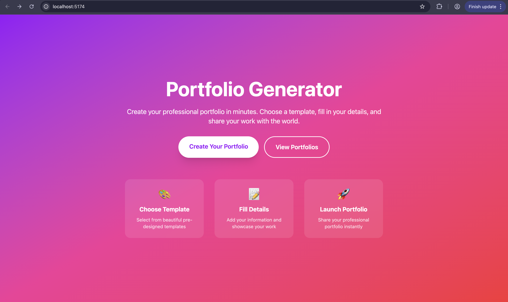
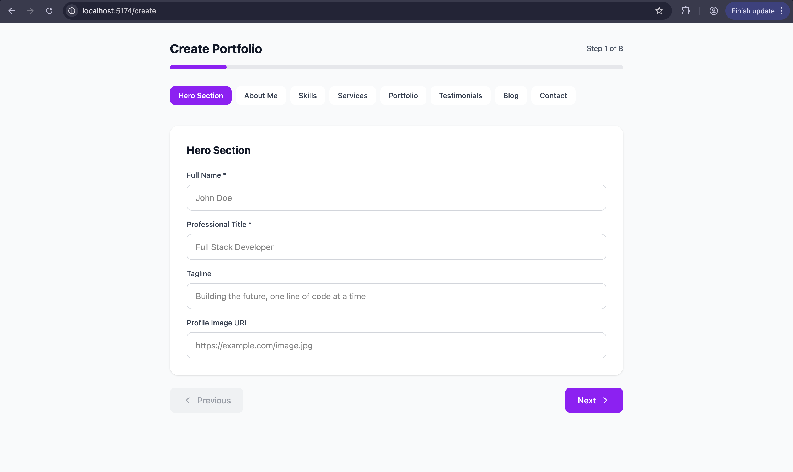
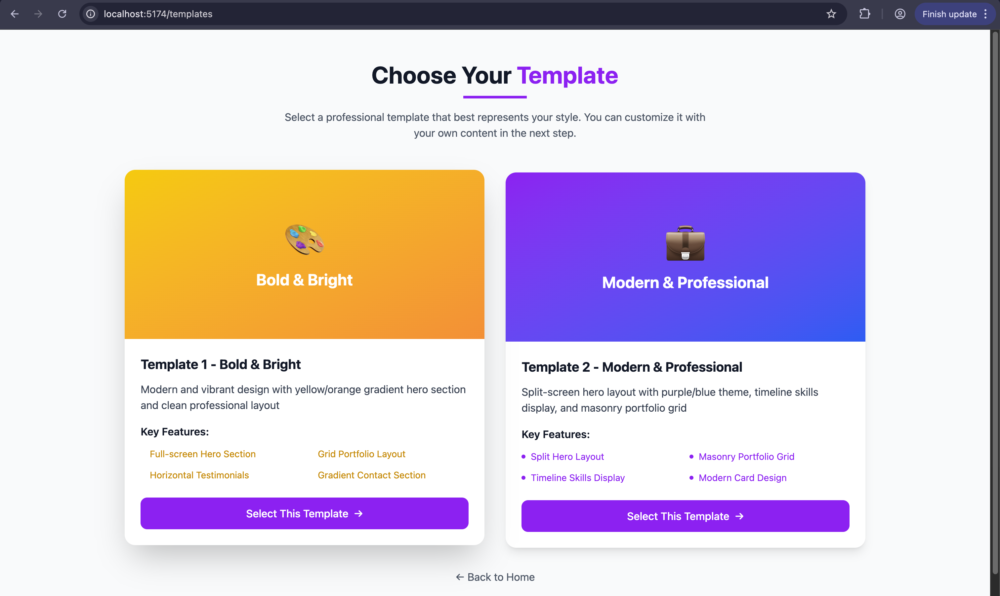
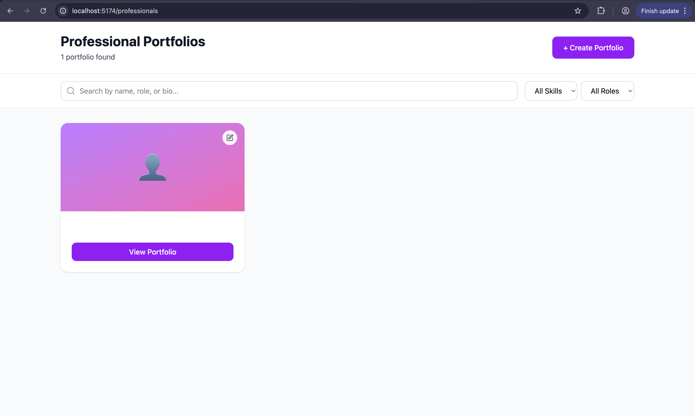

# Dynamic Portfolio Generator

A dynamic portfolio generator that lets users build and preview portfolio websites using structured forms and reusable templates.

## Live Demo

**Live link:** Not added yet
<!---
> Add your deployed app link here:
>
> `https://your-live-demo-link.com`

--->

## Topics

`react` `typescript` `portfolio-generator` `dynamic-portfolio` `template-builder` `form-driven-ui` `routing` `frontend` `portfolio-project` `resume-website`

---

## Screenshots

<!---> Add your screenshots inside a `screenshots/` folder in the root of the repository. --->

### Home Page


### Portfolio Form


### Template Selection


### Generated Portfolio Preview


### Mobile View


---

## Overview

Dynamic Portfolio Generator is a portfolio-building web application designed to help users create polished personal portfolio pages without manually coding every section from scratch. Users can enter structured information such as profile details, skills, projects, education, and experience, then generate a portfolio layout using predefined templates.

The goal of the project is to simplify portfolio creation for students, developers, freelancers, and job seekers by turning form-based input into a presentable portfolio interface.

Users can:
- choose a professional portfolio template
- enter their details through a guided multi-step form
- save portfolios locally
- browse saved portfolios
- open portfolio detail pages
- edit existing entries later

---

## Architecture Summary

The application follows a component-based frontend architecture focused on modular UI, reusable templates, and dynamic rendering.

### High-level flow

1. Users land on the home page.
2. They choose a portfolio template.
3. The selected template is stored locally.
4. They complete a multi-step portfolio form.
5. Portfolio data is saved in local storage.
6. Saved portfolios appear in the professionals listing page.
7. Users can open a portfolio detail page or edit an existing portfolio.

### Core modules

- **Form Module**  
  Collects portfolio data such as personal information, skills, education, projects, experience, and contact details.

- **Template Module**  
  Provides multiple layout options for rendering the same portfolio data in different styles.

- **Preview Module**  
  Displays the generated portfolio using the currently selected template and user data.

- **Routing Layer**  
  Handles navigation between the landing page, form flow, template selection, and final preview.

- **State Management Layer**  
  Manages user-entered portfolio data and selected template across the app.

---

## Feature List

- Modern landing page with clear CTA flow
- Template selection screen with 2 portfolio designs
- Multi-step portfolio creation form
- Hero section input
- About section input
- Skills/tags input
- Services section input
- Projects/portfolio section input
- Testimonials section input
- Optional blog section
- Contact section
- Local persistence with localStorage
- Browse all saved portfolios
- Search portfolios by name, title, and bio
- Filter portfolios by skill and role
- Open detailed portfolio pages
- Edit saved portfolios
- Responsive modern UI
- Reusable template-based rendering

---
### Templates Included
## Template 1 — Bold & Bright
full-screen hero section
grid portfolio layout
horizontal testimonials
gradient contact section
Template 2 — Modern & Professional
split hero layout
masonry portfolio grid
timeline-style skills display
modern card-based design

## Tech Stack

- React
- TypeScript
- React Router
- CSS / modular styling
- Tailwind CSS
- Lucide React
- Local Storage for persistence
- Component-based frontend architecture

---

## Folder Structure

```bash
dynamic-portfolio-generator/
├── Screenshots/
│   ├── Create_Portfolio.png
│   ├── Home_Page.png
│   ├── Template.png
│   └── View_Portfolios.png
├── src/
│   ├── app/
│   │   ├── components/
│   │   │   ├── figma/
│   │   │   └── templates/
│   │   │       ├── Template1.tsx
│   │   │       └── Template2.tsx
│   │   ├── pages/
│   │   │   ├── HomePage.tsx
│   │   │   ├── PortfolioFormPage.tsx
│   │   │   ├── PortfolioPage.tsx
│   │   │   ├── ProfessionalsListPage.tsx
│   │   │   └── TemplateSelectionPage.tsx
│   │   ├── App.tsx
│   │   ├── main.tsx
│   │   └── routes.ts
│   ├── imports/
│   └── styles/
├── .gitignore
├── ATTRIBUTIONS.md
├── index.html
├── package-lock.json
├── package.json
├── postcss.config.mjs
├── vite.config.ts
└── README.md
```
### Getting Started
   ## Prerequisites

# Make sure you have installed:

Node.js
npm
# Clone the repository
git clone https://github.com/vinay1500/dynamic-portfolio-generator.git
cd dynamic-portfolio-generator
# Install dependencies
npm install
# Run the development server
npm start

or, if your project uses Vite:

npm run dev
# Build for production
npm run build
## How It Works
1. Choose a template

The user selects one of the available portfolio templates.

2. Fill the form

The app guides the user through multiple sections:

Hero Section
About Me
Skills
Services
Portfolio
Testimonials
Blog
Contact
3. Save the portfolio

The form data is saved locally in the browser.

4. View portfolios

Users can browse created portfolios from the professionals listing page.

5. Open or edit

Each saved portfolio can be viewed in detail or edited later.


## Future Improvements
Add export to PDF
Add theme customization and color presets
Add drag-and-drop section reordering
Add image upload for profile and project thumbnails
Add local storage or database persistence
Add authentication and saved user portfolios
Add shareable portfolio URLs
Add GitHub or LinkedIn data import
Add admin/editor dashboard
Add deployment and publishing workflow
## License

This project is shared for portfolio, learning, and demonstration purposes.
